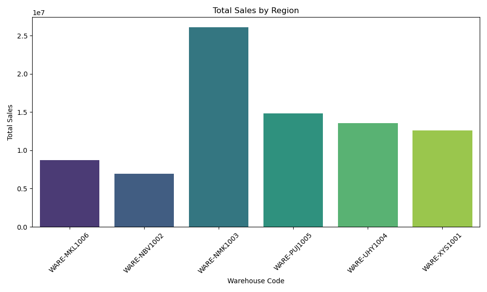
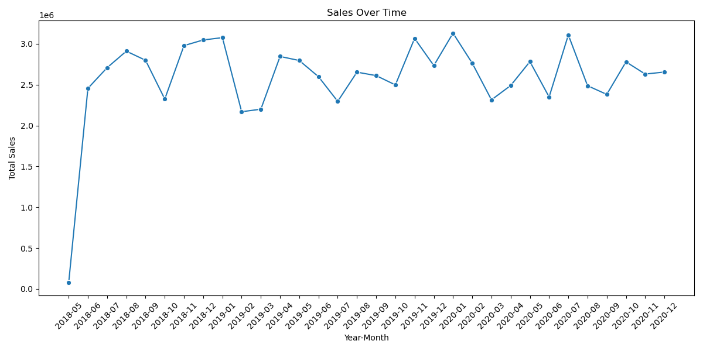
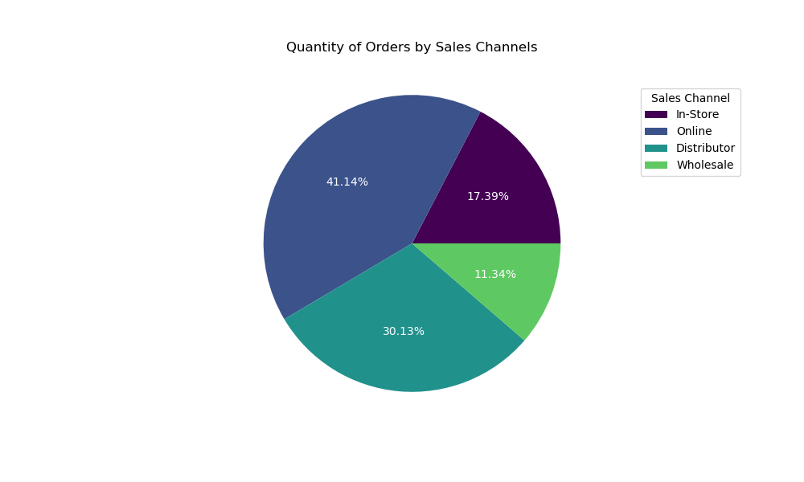

# Анализ Продаж с помощью Python

В этом проекте проводится анализ данных о продажах с помощью Python для определения ключевых показателей.

## Цели проекта

- Анализ объемов продаж по регионам.
- Анализ продаж по времени.
- Анализ количества заказов по каналам продаж.

## Используемые библиотеки

- Pandas
- Matplotlib
- Seaborn

## Анализ данных

Скрипт `analysis.ipynb` включает:
- Загрузка данных.
- Анализ данных и вычисление ключевых показателей.
- Визуализация результатов.

## Визуализации

- **Объемы продаж по регионам**:
  
- **Объемы продаж по времени**:
  
- **Объемы по каналам продаж**:
  
